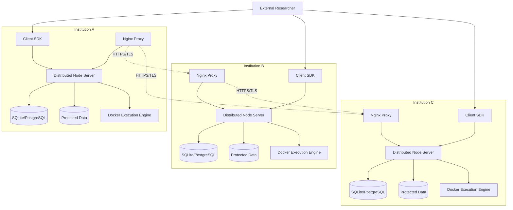
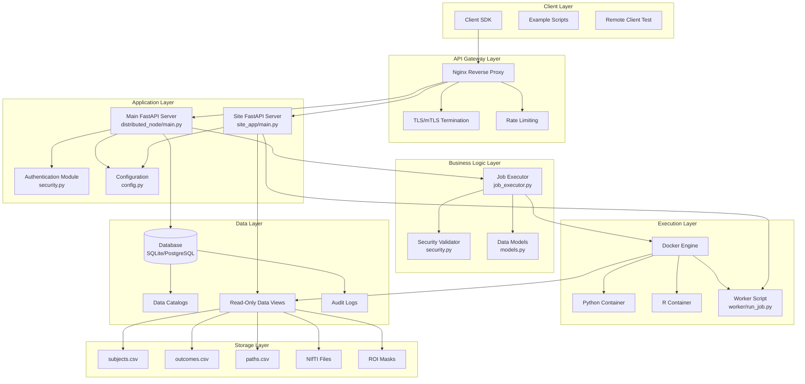
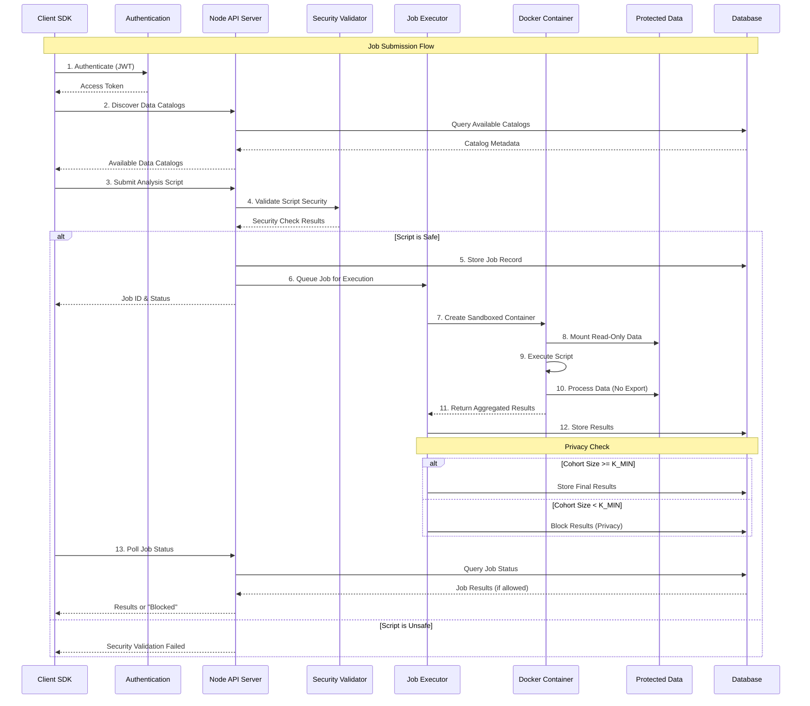
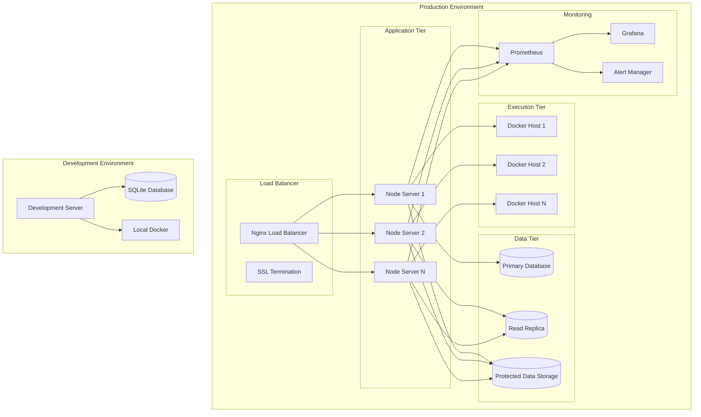

# StimNet System Architecture Diagram

## Overview
StimNet is a distributed data access and remote execution framework that enables secure, federated analysis across multiple institutions while preserving data privacy. The system follows a peer-to-peer model where each node can act as both a data provider and computation requester.

## High-Level Architecture



## Detailed Component Architecture



## Data Flow Architecture



## Security Architecture

```mermaid
graph TB
    subgraph "External Threats"
        Attacker[Malicious Actor]
        BadScript[Malicious Script]
        DataTheft[Data Exfiltration Attempt]
    end
    
    subgraph "Security Perimeter"
        WAF[Web Application Firewall]
        TLS[TLS 1.3 Encryption]
        mTLS[Mutual TLS (Optional)]
        RateLimit[Rate Limiting]
    end
    
    subgraph "Authentication & Authorization"
        JWT[JWT Tokens]
        RBAC[Role-Based Access Control]
        APIKeys[API Key Management]
        NodeAuth[Node-to-Node Auth]
    end
    
    subgraph "Script Security"
        ScriptValidator[Script Security Validator]
        Patterns[Dangerous Pattern Detection]
        Sandbox[Docker Sandbox]
        NetworkIsolation[Network Isolation]
    end
    
    subgraph "Data Protection"
        KAnonymity[K-Anonymity Enforcement]
        DifferentialPrivacy[Differential Privacy]
        AggregationOnly[Aggregation-Only Results]
        ReadOnlyMount[Read-Only Data Mounts]
    end
    
    subgraph "Monitoring & Auditing"
        AuditLog[Comprehensive Audit Logs]
        SecurityMonitoring[Security Event Monitoring]
        AccessLogging[Access Pattern Analysis]
    end
    
    %% Threat mitigation flows
    Attacker -.->|Blocked by| WAF
    BadScript -.->|Detected by| ScriptValidator
    DataTheft -.->|Prevented by| NetworkIsolation
    
    %% Security layers
    WAF --> TLS
    TLS --> JWT
    JWT --> ScriptValidator
    ScriptValidator --> Sandbox
    Sandbox --> KAnonymity
    KAnonymity --> AuditLog
```

## Deployment Architecture



## Technology Stack

### Backend Services
- **FastAPI**: RESTful API framework with automatic OpenAPI documentation
- **SQLAlchemy**: ORM for database operations with support for SQLite and PostgreSQL
- **Pydantic**: Data validation and settings management
- **Docker**: Containerized script execution environment
- **Nginx**: Reverse proxy, load balancing, and TLS termination

### Security & Authentication
- **JWT (JSON Web Tokens)**: Stateless authentication
- **bcrypt**: Password hashing
- **TLS 1.3**: Transport layer security
- **mTLS**: Mutual authentication (optional)

### Data Processing
- **pandas**: Data manipulation and analysis
- **numpy**: Numerical computing
- **scipy**: Scientific computing
- **nibabel**: Neuroimaging data I/O
- **scikit-learn**: Machine learning utilities

### Monitoring & Observability
- **Prometheus**: Metrics collection
- **Grafana**: Visualization and dashboards
- **Structured Logging**: JSON-formatted application logs

### Development & Deployment
- **Docker Compose**: Multi-container orchestration
- **pytest**: Testing framework
- **GitHub Actions**: CI/CD pipeline
- **Poetry/pip**: Dependency management

## Key Features

### Privacy Preservation
- **K-Anonymity**: Minimum cohort size enforcement (configurable K_MIN)
- **Differential Privacy**: Optional noise injection for enhanced privacy
- **Aggregation-Only Results**: No individual-level data export
- **Read-Only Data Access**: Immutable data views during execution

### Security Controls
- **Sandboxed Execution**: Network-isolated Docker containers
- **Script Validation**: Pattern-based security scanning
- **Resource Limits**: CPU, memory, and execution time constraints
- **Audit Trail**: Comprehensive logging of all operations

### Scalability & Reliability
- **Horizontal Scaling**: Multiple node servers behind load balancer
- **Async Processing**: Non-blocking job execution
- **Database Replication**: Read replicas for improved performance
- **Health Monitoring**: Automated health checks and alerting

### Developer Experience
- **OpenAPI Documentation**: Auto-generated API documentation
- **Client SDK**: Python SDK for easy integration
- **Example Scripts**: Ready-to-use analysis examples
- **Multi-Language Support**: Python, R, SQL, and Jupyter notebooks
