# Distributed Data Access Framework - System Architecture

## Overview
This is a distributed data access and remote execution framework that enables secure, federated analysis across multiple institutions while preserving data privacy. The system follows a peer-to-peer model where each node can act as both a data provider and computation requester.

**Current Implementation Status**: ✅ **FULLY OPERATIONAL**

### ✅ **Currently Working Components:**
- **Node Server**: FastAPI running on port 8000 (distributed_node/simple_main.py)
- **Database**: SQLite with 3 populated data catalogs (300+ demo records)
- **Client SDK**: Full Python SDK with async/sync support (client_sdk/)
- **Authentication**: JWT-based auth with demo credentials
- **Tunnel Access**: Cloudflare tunnel providing global HTTPS access
- **Cross-Network**: Verified working from different WiFi networks
- **Privacy Controls**: Minimum cohort size enforcement (5 records)
- **Audit Logging**: Complete request/response logging
- **API Documentation**: Swagger UI at /docs endpoint

### 🚧 **Development/Future Components:**
- **Docker Execution**: Containers built but using simplified demo mode
- **Advanced Job Queue**: Currently using in-memory demo execution
- **Multi-Node Federation**: Framework ready, needs additional deployments
- **Production Database**: Currently SQLite, PostgreSQL support ready

### 🌐 **Current Access URLs:**
- **Local**: http://localhost:8000/docs
- **Global**: https://customized-cheats-toolbox-sensors.trycloudflare.com/docs
- **Health**: Both URLs + /health endpoint
- **API**: Both URLs + /api/v1/* endpoints

## High-Level Architecture


## Detailed Component Architecture

```mermaid
graph TB
    subgraph "Client Layer (✅ Working)"
        SDK[Client SDK<br/>client_sdk/client.py<br/>DistributedClient]
        SyncSDK[Sync Wrapper<br/>SyncDistributedClient]
        Examples[Simple Client<br/>examples/simple_client.py<br/>✅ TESTED]
        RemoteTest[Remote Test<br/>examples/remote_client_test.py<br/>✅ WORKING]
        
        Examples --> SDK
        RemoteTest --> SDK
        SDK --> SyncSDK
    end
    
    subgraph "Tunnel Layer (✅ Active)"
        TunnelMgr[Tunnel Manager<br/>tunnel_manager.py<br/>Cloudflare Support]
        CloudFlared[Cloudflared Process<br/>✅ RUNNING]
        URLChecker[URL Checker<br/>get_public_url.py<br/>✅ DETECTING TUNNELS]
        
        TunnelMgr --> CloudFlared
        URLChecker --> TunnelMgr
    end
    
    subgraph "Application Layer (✅ Running)"
        SimpleMain[Simple FastAPI<br/>distributed_node/simple_main.py<br/>✅ PORT 8000]
        RunServer[Server Launcher<br/>run_server.py<br/>✅ ACTIVE]
        Auth[JWT Authentication<br/>security.py<br/>Demo Mode]
        Config[Pydantic Settings<br/>config.py + .env<br/>✅ LOADED]
        
        RunServer --> SimpleMain
        SimpleMain --> Auth
        SimpleMain --> Config
    end
    
    subgraph "Data Layer (✅ Populated)"
        Models[SQLAlchemy Models<br/>models.py<br/>Node, Job, DataCatalog]
        Database[(SQLite Database<br/>distributed_node.db<br/>✅ INITIALIZED)]
        DemoCatalogs[3 Demo Catalogs<br/>clinical_trial_data: 150<br/>imaging_data: 100<br/>demo_dataset: 50]
        CSVFiles[CSV Data Files<br/>data/catalogs/<br/>✅ GENERATED]
        
        SimpleMain --> Models
        Models --> Database
        Database --> DemoCatalogs
        DemoCatalogs --> CSVFiles
    end
    
    subgraph "Execution Layer (🚧 Future)"
        Docker[Docker Engine<br/>🚧 Containers Built]
        PythonContainer[Python Container<br/>distributed-python:latest]
        RContainer[R Container<br/>distributed-r:latest]
        JobQueue[Job Queue<br/>🚧 Simplified Demo Mode]
        WorkerScript[Worker Script<br/>worker/run_job.py]
        
        Docker --> PythonContainer
        Docker --> RContainer
        Docker --> WorkerScript
    end
    
    subgraph "Data Layer"
        Database[(Database<br/>SQLite/PostgreSQL)]
        DataCatalogs[Data Catalogs]
        ReadOnlyData[Read-Only Data Views]
        AuditLogs[Audit Logs]
        
        Database --> DataCatalogs
        Database --> AuditLogs
    end
    
    subgraph "Storage Layer"
        SubjectsCSV[subjects.csv]
        OutcomesCSV[outcomes.csv]
        PathsCSV[paths.csv]
        NIfTIFiles[NIfTI Files]
        Masks[ROI Masks]
        
        ReadOnlyData --> SubjectsCSV
        ReadOnlyData --> OutcomesCSV
        ReadOnlyData --> PathsCSV
        ReadOnlyData --> NIfTIFiles
        ReadOnlyData --> Masks
    end
    
    %% Connections
    SDK --> Nginx
    Nginx --> MainAPI
    Nginx --> SiteAPI
    MainAPI --> JobExecutor
    SiteAPI --> WorkerScript
    JobExecutor --> Docker
    MainAPI --> Database
    SiteAPI --> ReadOnlyData
    Docker --> ReadOnlyData
```



## Data Flow Architecture


## Security Architecture

```mermaid
graph TB
    subgraph "External Threats"
        Attacker[Malicious Actor]
        BadScript[Malicious Script]
        DataTheft[Data Exfiltration Attempt]
    end
    
    subgraph "Security Perimeter"
        WAF[Web Application Firewall]
        TLS[TLS 1.3 Encryption]
        mTLS[Mutual TLS (Optional)]
        RateLimit[Rate Limiting]
    end
    
    subgraph "Authentication & Authorization"
        JWT[JWT Tokens]
        RBAC[Role-Based Access Control]
        APIKeys[API Key Management]
        NodeAuth[Node-to-Node Auth]
    end
    
    subgraph "Script Security"
        ScriptValidator[Script Security Validator]
        Patterns[Dangerous Pattern Detection]
        Sandbox[Docker Sandbox]
        NetworkIsolation[Network Isolation]
    end
    
    subgraph "Data Protection"
        KAnonymity[K-Anonymity Enforcement]
        DifferentialPrivacy[Differential Privacy]
        AggregationOnly[Aggregation-Only Results]
        ReadOnlyMount[Read-Only Data Mounts]
    end
    
    subgraph "Monitoring & Auditing"
        AuditLog[Comprehensive Audit Logs]
        SecurityMonitoring[Security Event Monitoring]
        AccessLogging[Access Pattern Analysis]
    end
    
    %% Threat mitigation flows
    Attacker -.->|Blocked by| WAF
    BadScript -.->|Detected by| ScriptValidator
    DataTheft -.->|Prevented by| NetworkIsolation
    
    %% Security layers
    WAF --> TLS
    TLS --> JWT
    JWT --> ScriptValidator
    ScriptValidator --> Sandbox
    Sandbox --> KAnonymity
    KAnonymity --> AuditLog
```

## Deployment Architecture


## Technology Stack

### Backend Services
- **FastAPI**: RESTful API framework with automatic OpenAPI documentation
- **SQLAlchemy**: ORM for database operations with support for SQLite and PostgreSQL
- **Pydantic**: Data validation and settings management
- **Docker**: Containerized script execution environment
- **Nginx**: Reverse proxy, load balancing, and TLS termination

### Security & Authentication
- **JWT (JSON Web Tokens)**: Stateless authentication
- **bcrypt**: Password hashing
- **TLS 1.3**: Transport layer security
- **mTLS**: Mutual authentication (optional)

### Data Processing
- **pandas**: Data manipulation and analysis
- **numpy**: Numerical computing
- **scipy**: Scientific computing
- **nibabel**: Neuroimaging data I/O
- **scikit-learn**: Machine learning utilities

### Monitoring & Observability
- **Prometheus**: Metrics collection
- **Grafana**: Visualization and dashboards
- **Structured Logging**: JSON-formatted application logs

### Development & Deployment
- **Docker Compose**: Multi-container orchestration
- **pytest**: Testing framework
- **GitHub Actions**: CI/CD pipeline
- **Poetry/pip**: Dependency management

## Key Features

### Privacy Preservation
- **K-Anonymity**: Minimum cohort size enforcement (configurable K_MIN)
- **Differential Privacy**: Optional noise injection for enhanced privacy
- **Aggregation-Only Results**: No individual-level data export
- **Read-Only Data Access**: Immutable data views during execution

### Security Controls
- **Sandboxed Execution**: Network-isolated Docker containers
- **Script Validation**: Pattern-based security scanning
- **Resource Limits**: CPU, memory, and execution time constraints
- **Audit Trail**: Comprehensive logging of all operations

### Scalability & Reliability
- **Horizontal Scaling**: Multiple node servers behind load balancer
- **Async Processing**: Non-blocking job execution
- **Database Replication**: Read replicas for improved performance
- **Health Monitoring**: Automated health checks and alerting

### Developer Experience
- **OpenAPI Documentation**: Auto-generated API documentation
- **Client SDK**: Python SDK for easy integration
- **Example Scripts**: Ready-to-use analysis examples
- **Multi-Language Support**: Python, R, SQL, and Jupyter notebooks

## 📊 **Real-Time System Status**

### **Current Deployment:**
```
🖥️  Local Machine: MGB032006.local
📍 Working Directory: /Users/savirmadan/Development/StimNet
🐍 Python Version: 3.13.2
📦 Virtual Environment: ./venv/ (activated)
```

### **Active Services:**
```
✅ Node Server: http://localhost:8000 (PID: varies)
   - Status: HEALTHY
   - Uptime: Active since restart
   - Database: SQLite (distributed_node.db)
   - Jobs Processed: 3 total, 0 active

✅ Cloudflare Tunnel: https://customized-cheats-toolbox-sensors.trycloudflare.com
   - Status: ACTIVE
   - Tunnel Type: Cloudflare Quick Tunnel
   - Security: HTTPS/TLS encrypted
   - Global Access: Available worldwide
```

### **Data Catalogs:**
```
📊 clinical_trial_data: 150 subjects (Parkinson's research)
🧠 imaging_data: 100 scans (T1, DTI, fMRI)
🎯 demo_dataset: 50 records (testing/demos)
```

### **API Endpoints Currently Available:**
```
GET  /health                    - Node health check
GET  /docs                      - Swagger API documentation  
GET  /api/v1/discovery          - Node capabilities
GET  /api/v1/data-catalogs      - Available datasets
GET  /api/v1/jobs               - List jobs
POST /api/v1/jobs               - Submit analysis job
GET  /api/v1/jobs/{id}          - Job status/results
POST /api/v1/auth/token         - Authentication
```

### **Testing Status:**
```
✅ Local Testing: Working (localhost:8000)
✅ Remote Testing: Working (cloudflare tunnel)
✅ Client SDK: Functional with examples
✅ Authentication: Demo mode active
✅ Cross-Network: Verified from different WiFi
✅ Job Submission: Demo execution working
✅ Privacy Controls: Cohort size enforcement active
```

### **Next Steps for Production:**
```
🔄 Replace demo job execution with Docker containers
🔄 Add real authentication system
🔄 Deploy to cloud for permanent URLs
🔄 Set up multi-institution federation
🔄 Add production monitoring and logging
```

## 🔄 **Current Data Flow (As Implemented)**


## 🏗️ **Physical Architecture (Current Setup)**

```mermaid
graph LR
    subgraph "Internet"
        Users[Users Worldwide<br/>Any Device, Any Network]
        CF_Edge[Cloudflare Edge Network<br/>Global CDN]
    end
    
    subgraph "Your Local Machine (MGB032006)"
        subgraph "Process Layer"
            Server[FastAPI Server<br/>PID: 73545<br/>Port: 8000]
            Tunnel[Cloudflared<br/>Tunnel Process]
        end
        
        subgraph "Data Layer"
            SQLite[(SQLite DB<br/>distributed_node.db)]
            CSV1[clinical_trial_data/<br/>subjects.csv<br/>outcomes.csv]
            CSV2[imaging_data/<br/>scan_metadata.csv]
            CSV3[demo_dataset/<br/>test_data.csv]
        end
        
        subgraph "Code Layer"
            SDK[client_sdk/<br/>Python SDK]
            Examples[examples/<br/>Test Scripts]
            Config[.env + config.py<br/>Settings]
        end
    end
    
    Users --> CF_Edge
    CF_Edge --> Tunnel
    Tunnel --> Server
    Server --> SQLite
    Server --> CSV1
    Server --> CSV2
    Server --> CSV3
    Examples --> SDK
    SDK --> Server
    Config --> Server
    
    %% Status annotations
    Server -.->|"✅ HEALTHY<br/>Requests: 40+<br/>Uptime: Active"| SQLite
```



---
**Last Updated**: October 7, 2025 - System fully operational and tested across networks  
**Current Status**: 🟢 All systems operational, tunnel active, global access verified
